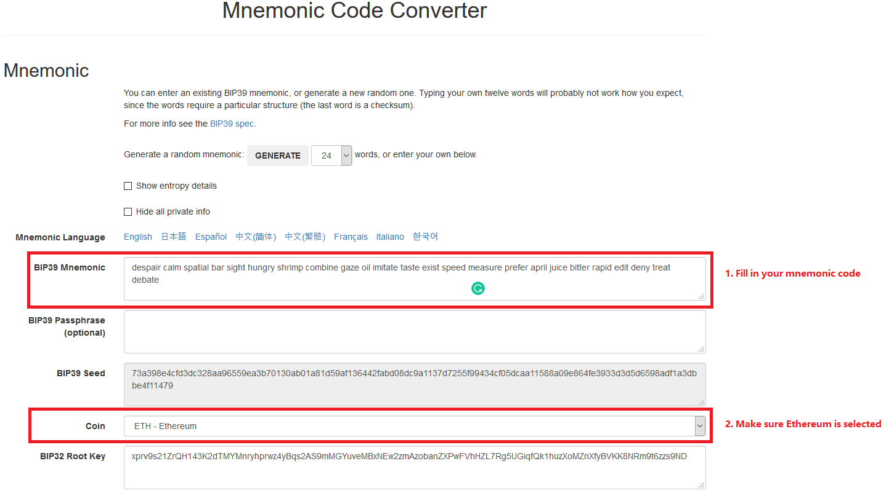
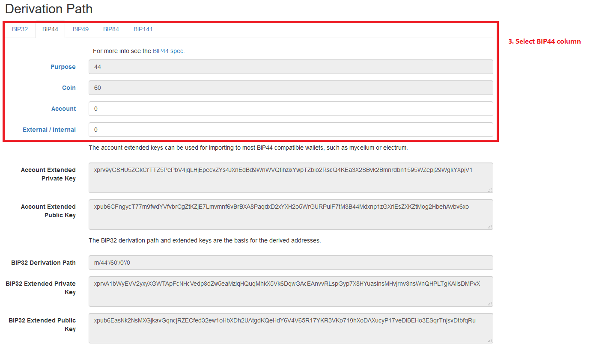
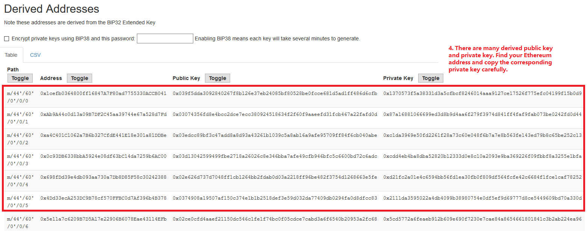

Sorry to hear that, but don't worry. If you still remember the Mnemonic Code(usually 24 words) of your HD wallet, you can derive the private key and then the keystore. The keystore can be used in cpchain wallet to  control your balance.

Please follow the guide below.
## Derive private key from Mnemonic Code
-  Go to  https://iancoleman.io/bip39/ 

    This is the site where you can derive your address/public/private key from your Mnemonic Code
- Fill in your  Mnemonic Code
    

- Select BIP44 derivation path

    

- Find the address you are using
    

<!-- ## Export keystore with Go-ethereum.

You get `keystore` by import the private key using `Ethereum Geth program`.

- Download Ethereum Geth from this [link](https://geth.ethereum.org/downloads/), We take Ubuntu platform for example.

- Save your private key string(please remove the '0x' prefix), in a file, like `private_key`.

- Import private key using this command, you are asked to set the passphrase. You get the keystore in your home folder. The file name is prefixed with `UTC` time.

```shell
./geth  account import ./private_key --datadir ~
```
```shell
zzz@ubuntu:~$ ./geth  account import ./private_key --datadir ~
INFO [07-09|22:55:11.462] Maximum peer count                       ETH=25 LES=0 total=25
Your new account is locked with a password. Please give a password. Do not forget this password.
Passphrase:
Repeat passphrase:
Address: {1cefb0364800ff16847a7f80ad7755330accb041}
```
```sh
zzz@ubuntu:~$ ls ./keystore/
UTC--2019-07-10T05-55-12.805083388Z--1cefb0364800ff16847a7f80ad7755330accb041
``` -->
## Import your private key to your cpchain wallet.